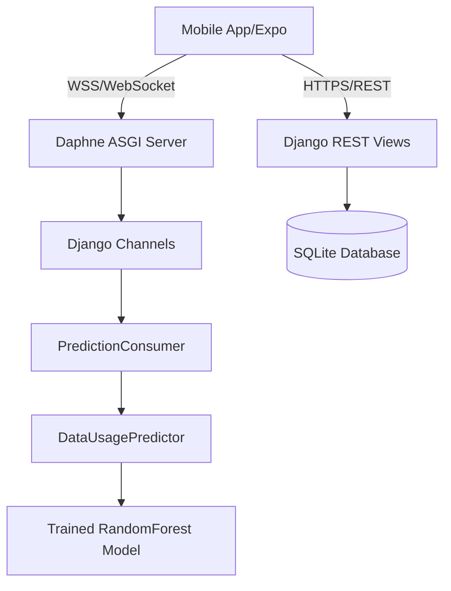

# DATAra Backend

The robust backend service for **DATAra** — a full-stack mobile data consumption monitoring and prediction application. It utilizes **Django REST Framework** for authenticated API services, **Django Channels** and **Daphne** for real-time WebSocket machine learning predictions, and **scikit-learn** for Random Forest predictive modeling.

---

## 🚀 Tech Stack
- **Web Framework**: Python 3.10+ / Django 5.x / DRF
- **Asynchronous Web Server**: Daphne (ASGI)
- **Real-Time Layer**: Django Channels (supporting Redis or In-Memory layers)
- **Machine Learning**: Scikit-Learn (Random Forest Regressor), Joblib, Pandas, NumPy
- **Database**: SQLite (local development / volume mounted for persistence)

---

## 🛠️ Setup & Installation

1. **Create and Activate Virtual Environment**:
   ```bash
   python -m venv venv
   # On Windows:
   .\venv\Scripts\activate
   # On macOS/Linux:
   source venv/bin/activate
   ```

2. **Install Dependencies**:
   ```bash
   pip install -r requirements.txt
   ```

3. **Run Database Migrations**:
   ```bash
   python manage.py migrate
   ```

4. **Train the ML Model**:
   Ensure you have baseline harvest CSV files in the parent `CSV/` directory, then run:
   ```bash
   python api/train_model.py
   ```

5. **Start Asynchronous Server (Daphne)**:
   ```bash
   python manage.py runserver
   # Or run explicitly via Daphne:
   daphne -p 8000 datara_backend.asgi:application
   ```

---

## ⚙️ Architecture & Configurations



### Environment Variables
Configure these variables in your environment or production hosting dashboard:
- `SECRET_KEY`: *Django security key*
- `DEBUG`: `False` (for production)
- `DATABASE_PATH`: Custom path to `db.sqlite3` (e.g. `/app/data/db.sqlite3`)
- `ML_MODEL_PATH`: Custom path to `data_depletion_model.joblib`
- `REDIS_URL`: Redis server URL for Channels layer (e.g. `redis://127.0.0.1:6379`)

---

## 📂 Project Structure
```text
DATAra-backend/
├── api/
│   ├── migrations/
│   ├── ml_models/           # Saved model .joblib and evaluation metrics.json (git ignored)
│   ├── consumers.py         # WebSocket channel handler for live ML predictions
│   ├── predictor.py         # Prediction logic using RandomForestRegressor
│   ├── train_model.py       # Model training & metrics evaluation script
│   ├── models.py            # SQLite schemas (UserProfile, DataUsageRecord)
│   ├── serializers.py       # DRF serializers
│   ├── sync_views.py        # Local/global CSV sync and average consumption views
│   ├── urls.py              # API routes
│   └── views.py             # Authentication and CRUD usage records
├── datara_backend/
│   ├── asgi.py              # ASGI entry point for Channels/Daphne
│   ├── settings.py          # DRF + Channels configuration
│   └── urls.py              # Main URL patterns
├── manage.py
├── requirements.txt
└── README.md
```

---

## 🔗 REST API Endpoint Summary

All data-access endpoints require an `Authorization: Token <user_token>` header.

| Method | Endpoint | Auth | Description |
| :--- | :--- | :---: | :--- |
| `POST` | `/api/register/` | No | Register a new account (validates password & phone number) |
| `POST` | `/api/login/` | No | Log in and receive auth token (verifies active status) |
| `GET` | `/api/profile/` | Yes | Retrieve profile details (region, barangay, provider, etc.) |
| `PUT` | `/api/profile/` | Yes | Update profile details |
| `DELETE`| `/api/profile/` | Yes | Soft-delete user account (marks inactive & anonymizes username) |
| `GET` | `/api/usage/` | Yes | List usage history records for the current user |
| `POST` | `/api/usage/` | Yes | Log a new usage record |
| `GET` | `/api/usage/summary/` | Yes | Retrieve total usage, budget remaining, and daily average metrics |
| `GET` | `/api/ml/metrics/` | Yes | Fetch MAE, RMSE, and R2 metrics of the trained ML model |
| `GET` | `/api/sync/status/` | Yes | Check count of local network and traffic CSV records |
| `POST` | `/api/sync/record/` | Yes | Append current client usage to local CSVs |
| `POST` | `/api/sync/upload-global/`| Yes | Upload user local CSVs to the `CSV/uploaded_datasets` directory |
| `GET` | `/api/sync/download-local/`| Yes | Pack user local CSV files into a `.zip` archive for export |
| `POST` | `/api/sync/generate-mock/`| Yes | Generate mock data points for client testing |
| `GET` | `/api/sync/global-averages/`| Yes | Calculate baseline averages from global datasets in `CSV/` |

---

## 📡 Live Prediction WebSocket Endpoint

**WebSocket Connection URL**: `ws://<backend_url>/ws/predictions/?token=<user_token>`

Once the connection is established, the client streams battery, screen, and remaining data variables. The backend responds with depletion estimates.

### Client Payload (Inbound)
```json
{
  "remaining_mb": 4500.0,
  "expiry_time": "2026-06-01T12:00:00",
  "screen_on": 4.5,
  "battery_level": 75.0
}
```

### Server Response (Outbound)
```json
{
  "status": "prediction_updated",
  "remaining_mb": 4500.0,
  "hours_remaining": 42.5,
  "depletion_time": "2026-05-31T06:30:00",
  "runs_out_before_expiry": true,
  "usage_pace": "warning",
  "hours_to_expiry": 72.0,
  "predicted_trajectory": [
    { "hour_offset": 1, "predicted_mb": 25.5, "cumulative_mb": 25.5 }
  ]
}
```

---

## 🧠 Machine Learning Details

The system trains a **Random Forest Regressor** to predict hourly data consumption.
- **Features Used**: `hour`, `day_of_week`, `is_weekend`, `screen_on`, `battery_level`
- **Target Value**: `mb_used`
- **Model Evaluation**: Metrics (Mean Absolute Error, Root Mean Squared Error, R-squared) are computed and stored in `api/ml_models/metrics.json` at training time. These are viewable on the client via the Settings panel.
- **Dynamic Fallbacks**: In the event that the model files are not trained or fail to load, the system runs an active, rule-based fallback model distributing peak vs off-peak consumption bounds, maintaining client responsiveness.
